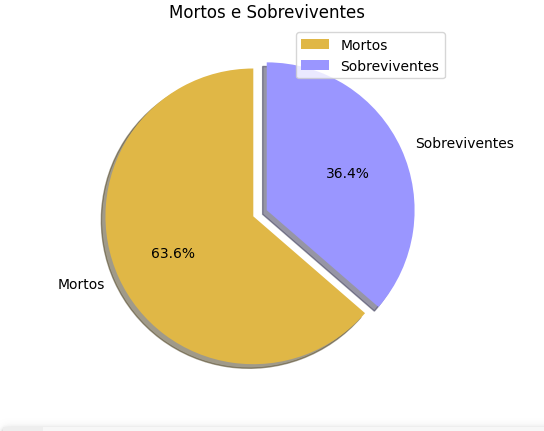

# Atividade

Nome: Lucas Vieira da Silva 
Matrícula: **01301103**

## Sobreviventes e Vítimas Titanic
Codigo no arquivo `titanic.py`

~~~python
import pandas as pd
import matplotlib.pyplot as plt
import numpy as np

from google.colab import drive
drive.mount('/content/drive')

df = pd.read_csv('/content/drive/MyDrive/titanic.csv')
df2 = df.groupby(['Survived'])['Survived'].count()

y = np.array(df2)
cores = ['#e0b746', '#9a96ff']
explode = [0.1, 0]

plt.pie(y, labels=['Mortos', 'Sobreviventes'], explode=explode , shadow=True, colors=cores, autopct='%1.1f%%', startangle = 90)
plt.title('Mortos e Sobreviventes')
plt.legend()
plt.show()
~~~

